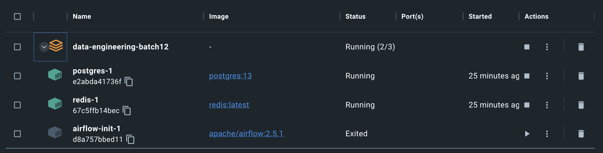
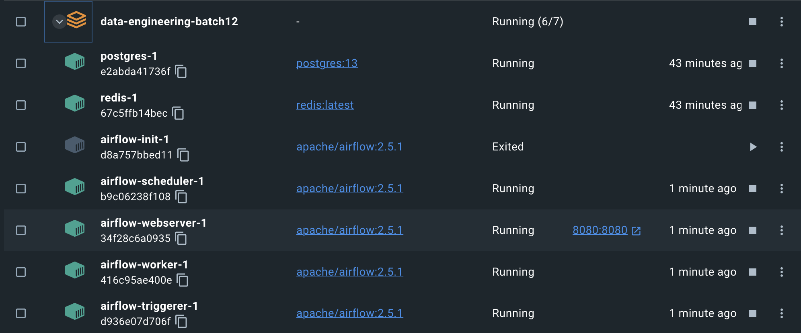
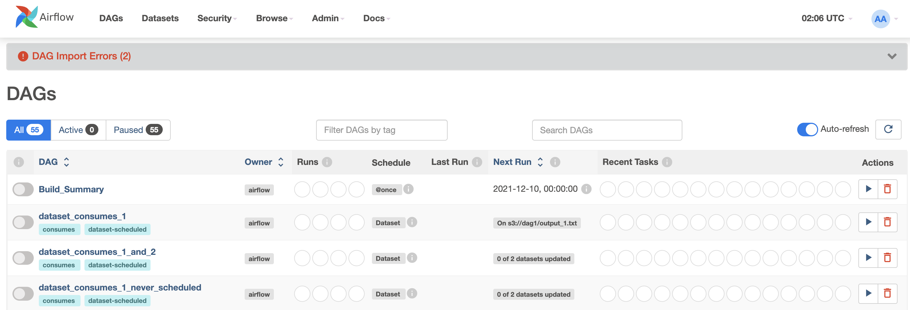

## Local Development
### One-Time Setup
#### Install Docker
Follow these steps to install the necessary tools.

1. Install [Docker Community Edition (CE)](https://docs.docker.com/engine/installation/) on your workstation. Depending on the OS, you may need to configure your Docker instance to use 4.00 GB of memory for all containers to run properly. Please refer to the Resources section if using [Docker for Windows](https://docs.docker.com/docker-for-windows/#resources>) or [Docker for Mac](https://docs.docker.com/docker-for-mac/#resources) for more information.
2. Check if you have `docker-compose` installed buy running `docker-compose --version`
3. If not installed, install [Docker Compose](https://docs.docker.com/compose/install/) v1.29.1 and newer on your workstation (I'm using `v2.15.1`)

Older versions of ``docker-compose`` do not support all the features required by ``docker-compose.yaml`` file, so double check that your version meets the minimum version requirements.


#### Docker Setting
1. Allocate at least 4GB (ideally 8GB) of memory to Docker. This is very important. You can increase the memory from Settings -> Resources -> ADVANCED menu from Docker Desktop

#### Install `pipenv`
The Docker image we use relies on `pipenv` to create a virtual environment with appropriate packages downloaded.

Run
```
$ pip3 install pipenv
```

Though the image itself has command to download `pipenv` to be used in the container, you want to make sure you can generate a `Pipfile.lock` file, since the container will ignore the `Pipfile` and use the `Pipfile.lock` to install packages.

For more information on `pipenv`, please refer to this [page](https://pipenv-fork.readthedocs.io/en/latest/basics.html).

### Spinning Up Local Airflow Services
1. data-engineering-batch12 리포를 다운로드받고 메인폴더로 이동한다.
```
git clone https://github.com/keeyong/data-engineering-batch12.git
cd data-engineering-batch12
```
2. Airflow 2.5.1에 해당하는 docker-compose.yaml을 다운로드받는다.
```
curl -LfO 'https://airflow.apache.org/docs/apache-airflow/2.5.1/docker-compose.yaml'
```
3. `docker compose up airflow-init`를 실행한다. 이 때 Redis와 Postgres가 실행되고 Airflow 설치가 완료된다.

4. Airflow를 실행하기 위해 `docker compose up` 명령을 실행한다.
5. `docker ps` 명령을 실행해서 모든 프로세스가 동작하는지 확인한다.
```
CONTAINER ID   IMAGE                  COMMAND                  CREATED          STATUS                   PORTS                    NAMES
416c95ae400e   apache/airflow:2.5.1   "/usr/bin/dumb-init …"   11 minutes ago   Up 3 minutes (healthy)   8080/tcp                 data-engineering-batch12-airflow-worker-1
b9c06238f108   apache/airflow:2.5.1   "/usr/bin/dumb-init …"   11 minutes ago   Up 3 minutes (healthy)   8080/tcp                 data-engineering-batch12-airflow-scheduler-1
d936e07d706f   apache/airflow:2.5.1   "/usr/bin/dumb-init …"   11 minutes ago   Up 3 minutes (healthy)   8080/tcp                 data-engineering-batch12-airflow-triggerer-1
34f28c6a0935   apache/airflow:2.5.1   "/usr/bin/dumb-init …"   11 minutes ago   Up 3 minutes (healthy)   0.0.0.0:8080->8080/tcp   data-engineering-batch12-airflow-webserver-1
e2abda41736f   postgres:13            "docker-entrypoint.s…"   53 minutes ago   Up 3 minutes (healthy)   5432/tcp                 data-engineering-batch12-postgres-1
67c5ffb14bec   redis:latest           "docker-entrypoint.s…"   53 minutes ago   Up 3 minutes (healthy)   6379/tcp                 data-engineering-batch12-redis-1
```
도커 프로그램에서 위의 프로세스들이 실행되고 있는지 다시 한번 확인한다

5. 브라우저를 열고 `http://localhost:8080/`로 접근한다. 다음과 같은 로그인 페이지가 보여야 한다:

6. 아래 정보로 로그인한다
    * username: `airflow`
    * password: `airflow`
7. 로그인하면 아래와 같은 페이지가 보여야 한다


### Shutting Down Local Airflow Services
1. `ctrl+c`

2. Run `docker compose down`


### Volumes
Since the `docker-compose.yaml` file takes care of mounting the `./dags` folder for us. You can start developing your code and create DAGs in the `./dag` folder the same way we used to do on the Airflow server. Anything you changes there should be reflected in the container locally running Airflow.

### Cleanup
It's recommended that you clean up dangling Docker images resulted from multiple build versions from time to time to free up space on your machine. To do this please run: `docker system prune`

When prompted:
```
WARNING! This will remove:
  - all stopped containers
  - all networks not used by at least one container
  - all dangling images
  - all dangling build cache

Are you sure you want to continue? [y/N]
```
please answer: `y` then hit `enter` key

### Advance Usage
#### Adding Packages
1. Add package to `requirements.txt`
2. Run `pipenv install -r requirements.txt`
3. To spin up Airflow with new changes, run `docker-compose up --build`

Note: Installing from `requirements.txt` via `pipenv` only appends packages to the `Pipfile` file. The installation does NOT remove packaged already in `Pipfile` that are not in the `requirements.txt` file
